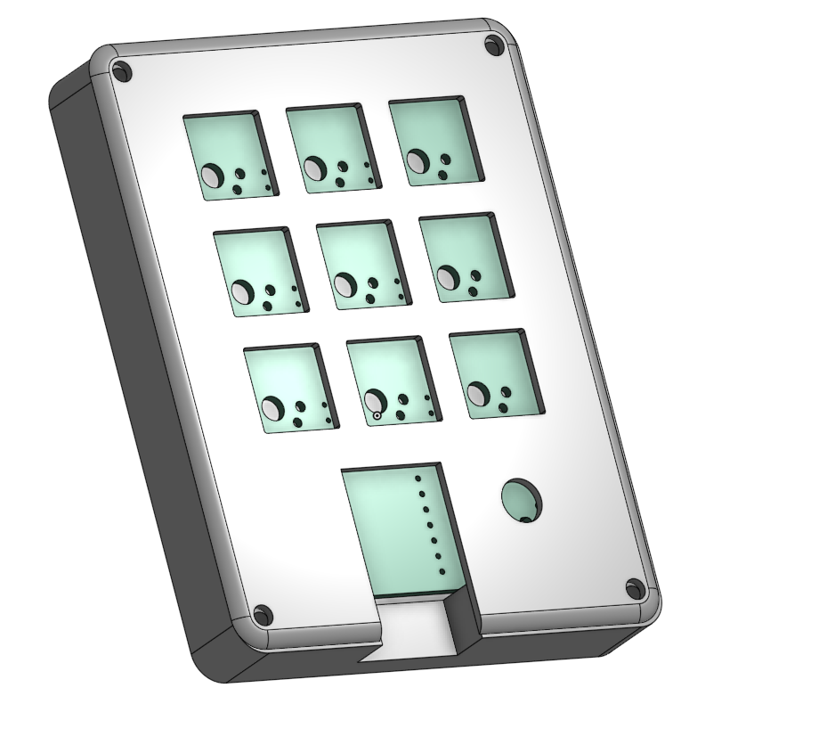
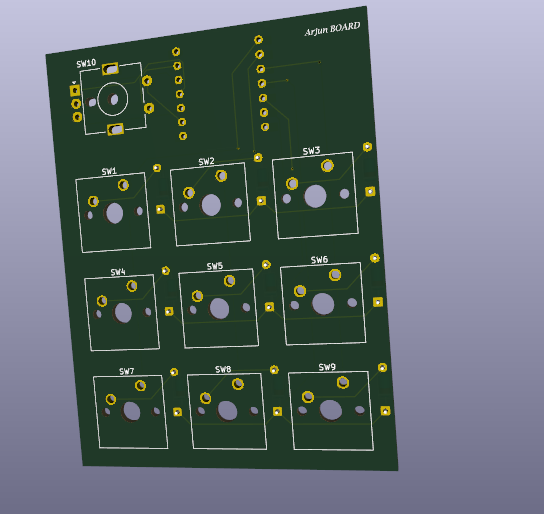
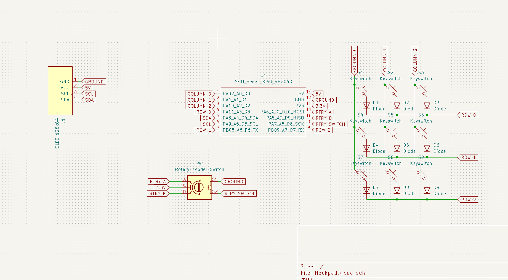
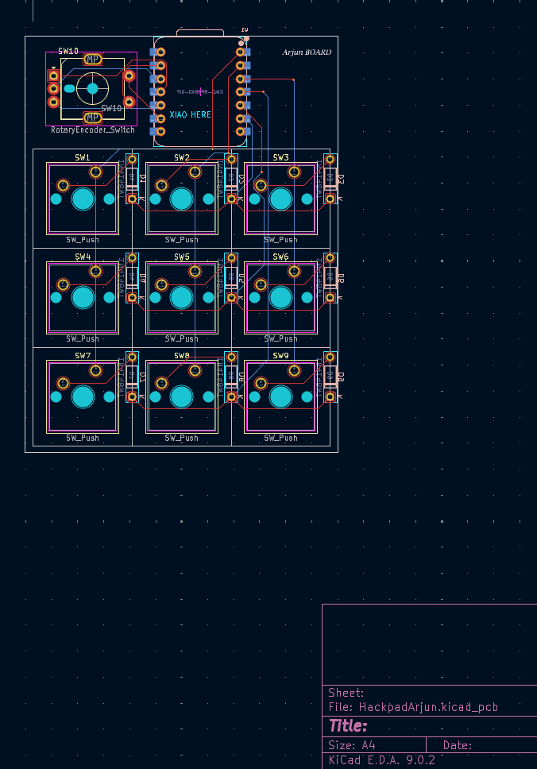
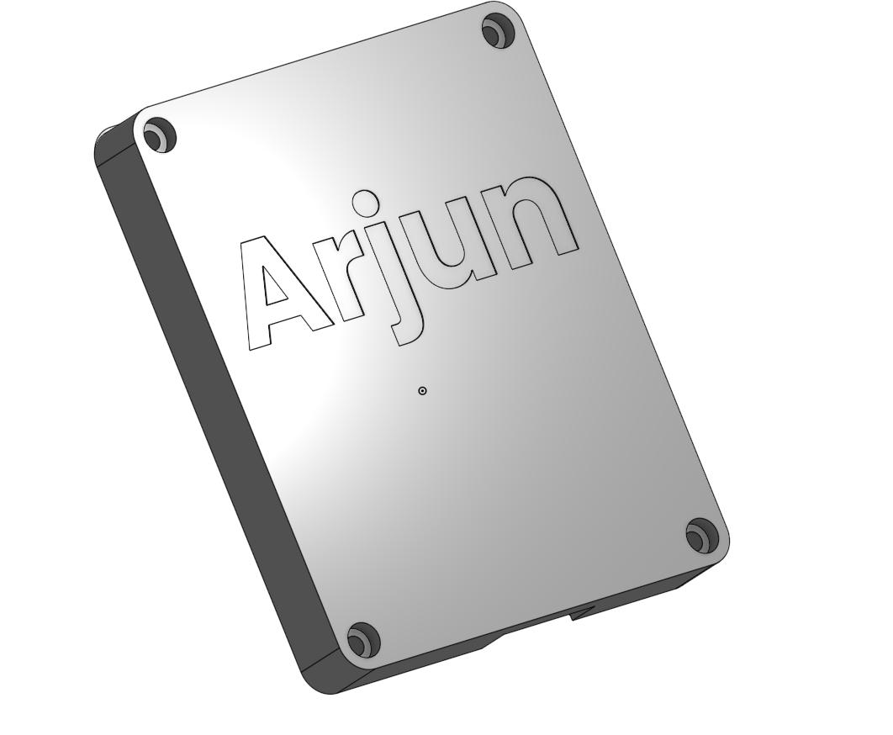

**Total time spent: 8.5h - 9h**

---

# June 26: Planning the Macropad

I sketched out my vision for the DM’s Grimoire today—9 spell‑like keys RGB mood lights, and a Pi Zero 2 W brain. Brainstormed feature list and started rough layout sketches. Also watched a bunch of tutorials on how to do this. 

**Total time spent: 2h**

---

# June 28: CAD Top Plate Prototype

In Onshape, I built the top plate: a 3×3 switch grid with cutout. Figured out switch spacing and screw hole placement. Struggled with making the screw hole stuff.

**Total time spent: 1.5h**

---

# June 29: Engraving + Size

Fixed sizing of CAD, Adjusted the mount to be perfectly flush with the case surface + engraved my name

**Total time spent: 1h**

---

# June 30: PCB Schematic & Layout

Created schematic in KiCad: 9‑switch thing, data line for WS2812. Laid out PCB footprint and aligned header pins. Realized I messed up the routing completly. learned how to route thanks to youtube, exported properly 

**Total time spent: 2.5h**

---

# July 1: Repo Setup & Documentation Prep

Pushed to github, Exported front/back pad renders and schematic. Waiting on parts, in the meantime planning how to code the firmware to intergrate with my D&D elements. Did research on communication protocols over bluetooth to control various elements (sound effects, lighting change, etc). Future steps, add in dungeon elements to the case. 

