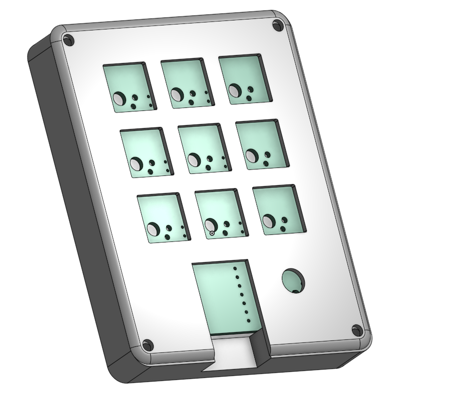
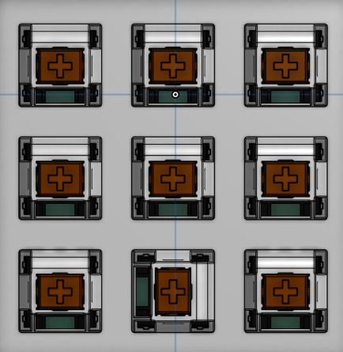
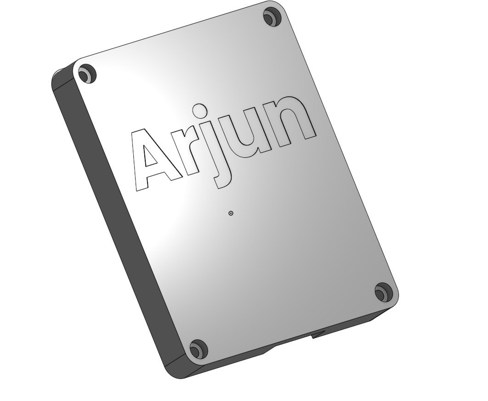
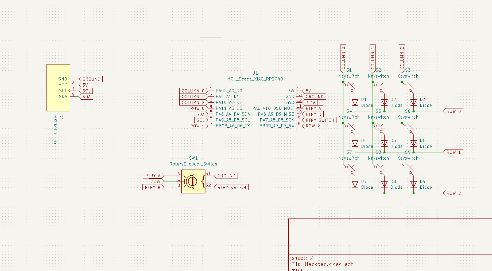
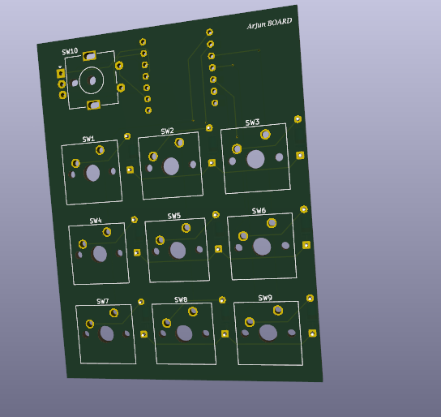
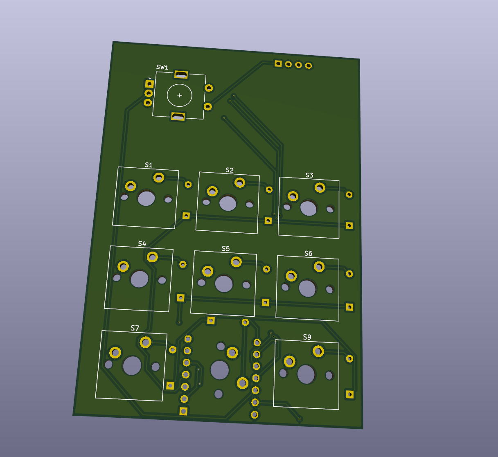
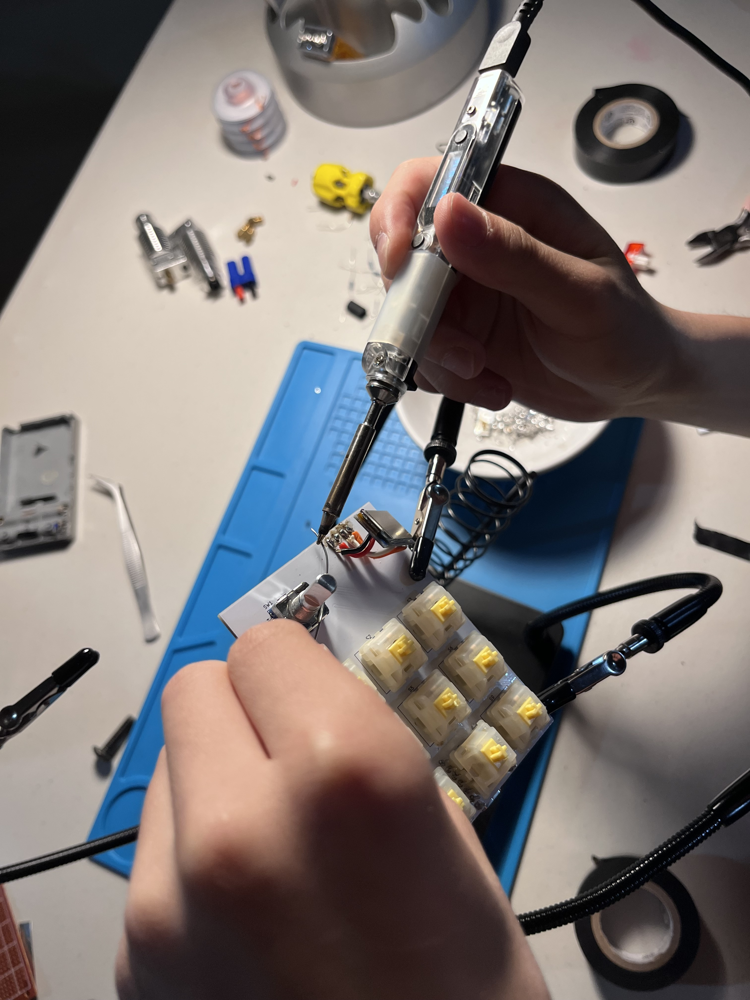
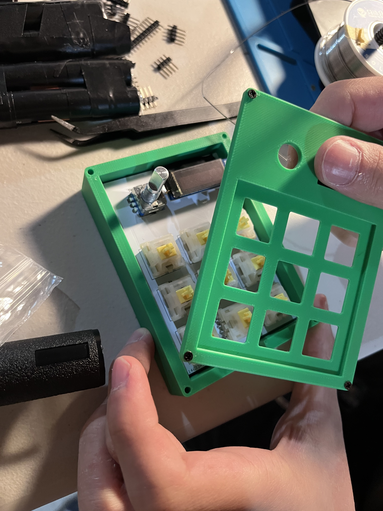
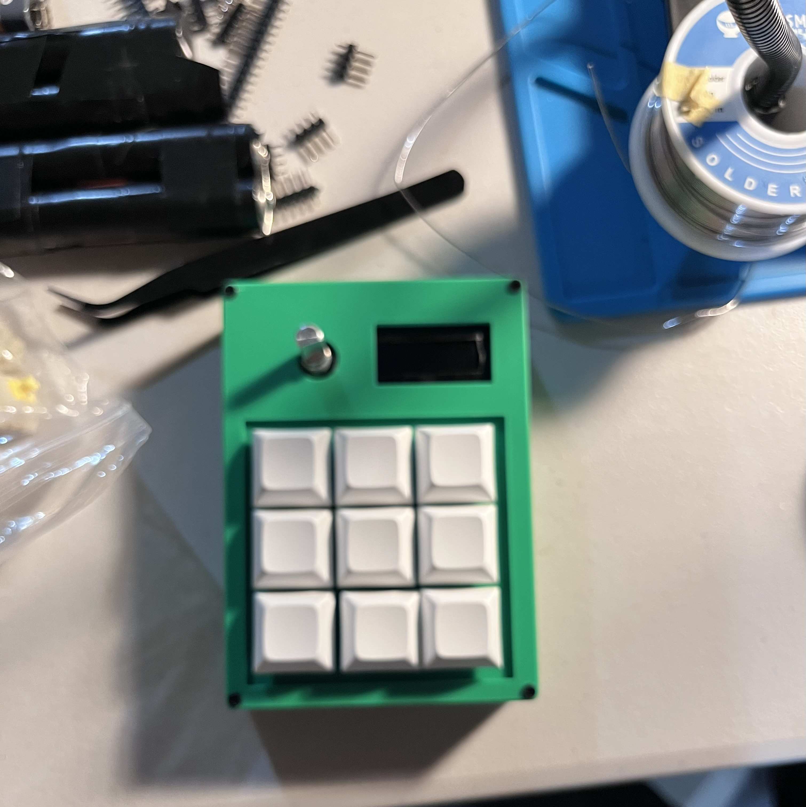

**Total time spent: 14h - 14.5h**

---

# June 26: Planning the Macropad

I sketched out my vision for the DM’s Grimoire today—9 spell‑like keys RGB mood lights, and a Pi Zero 2 W brain. Brainstormed feature list and started rough layout sketches. Also watched a bunch of tutorials on how to do this. 

**Total time spent: 2h**

---

# June 28: CAD Top Plate Prototype

In Onshape, I built the top plate: a 3×3 switch grid with cutout. Figured out switch spacing and screw hole placement. Struggled with making the screw hole stuff.

**Total time spent: 1.5h**

---

# June 29: Engraving + Size

Fixed sizing of CAD, Adjusted the mount to be perfectly flush with the case surface.

**Total time spent: 1h**

---

# June 30: PCB Schematic & Layout

Created schematic in KiCad: 9‑switch thing, data line for WS2812. Laid out PCB footprint and aligned header pins. Realized I messed up the routing completly. learned how to route thanks to youtube, exported properly 

**Total time spent: 2.5h**

---

# July 1: Repo Setup & Documentation Prep

Pushed to github, Exported front/back pad renders and schematic. Waiting on parts, in the meantime planning how to code the firmware to intergrate with my D&D elements. Did research on communication protocols over bluetooth to control various elements (sound effects, lighting change, etc). Future steps, add in dungeon elements to the case. 

---

# August 1: Kit Arrival (Waiting on PCB)

Hackpad parts kit finally showed up today including the switches, OLED, rotary encoder, headers, basically everything except the actual PCB. Laid the components out, dry‑fitted a few switches into the printed plate just to feel the clicky satisfaction and verified the OLED clearance against the case model. Mostly a logistics day; resisted the urge to start soldering onto a proto board so I don't create extra work.

*No dedicated build time logged (inspection only).* 

---

# August 3: PCB Delivery + Case Print & Test Fit

PCB landed two days after the rest of the kit. Immediately sliced the case parts and printed the enclosure to confirm tolerances. Did a gentle test fit: PCB lined up with standoffs, switch plate seated cleanly, and the encoder shaft cleared the opening exactly as planned. Huge relief that the footprint exports and spacing decisions were solid.

*Time not formally tracked (fit/print cycle + inspection).* 

---

# August 4: Full Solder Session

Big build push today. Soldered all 9 switches, the Seeed XIAO RP2040, the OLED header, and the rotary encoder. Midway through I snapped a pin on one switch while re‑aligning, swapped it out with a spare, no harm done. Continuity‑checked the data line and power rails; everything looked clean under magnification. Board is now electrically alive.

**Total time spent: 2h**

---

# August 5: Firmware Pivot & Feature Mapping

Started firmware with Arduino tooling, but hit the wall when I wanted Python + KMK flexibility. Switched over to CircuitPython; reflashed the XIAO and rebuilt the layout logic. Mapped the 9 keys into thematic groups: 3 for RGB ambient modes, 3 bound to auto dice rolls (different dice faces), and 3 triggering sound effect hooks. Rotary encoder + OLED groundwork laid for future status display (e.g., active lighting mode / last roll). Core event loop now stable.

**Total time spent: 3h**

---

# August 7: Final Assembly & Validation

Did an integrated test pass before sealing it up. All switches firing, RGB routines cycling, dice roll functions returning correct ranges, and sound effect triggers dispatching. Mounted PCB into the printed case, fastened screws, gently torque‑checked so I don't warp the board. Quick re‑test after enclosure closure — solid. Ready for real session use.

Demo video: https://youtube.com/shorts/aW9sag3_JPg
Demo Link: https://www.reddit.com/r/ArjunsWorld/comments/1mqmux4/hackpad/

**Total time spent: 0.5h**
