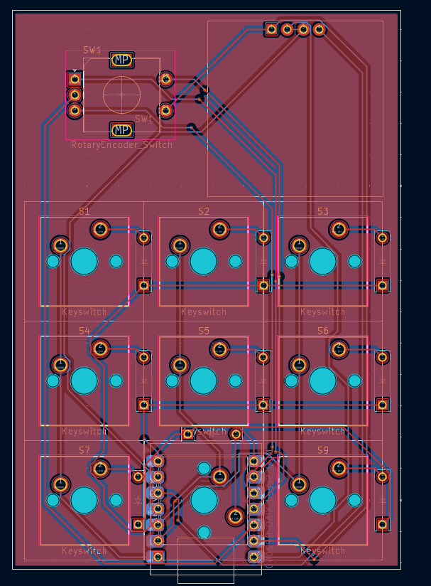

# The DM’s Grimoire

The **DM’s Grimoire** is a D&D **macropad** built for Dungeon Masters to control their campaigns. With 9 mechanical keys, an OLED display, RGB lighting, and a custom spellbook‑style enclosure, this device becomes a physical “grimoire” of power for any tabletop roleplaying game.

---

## Why I Made This

As a long‑time Dungeon enjoyer and the permanent dungeon master (no thanks to my friends), I wanted something that was extremely functional — I wanted it to feel like an artifact from the game world itself. Instead of clicking around with a mouse, now I press a button and summon a thunderstorm… or a dragon roar.

---

## Project Photos

### Front View  

### Back View  

---

## 3D Model Screenshot

The 3D‑printed case was modeled in Fusion360 and designed to resemble a magical tome.

---

## Wiring Diagram / Schematic

Here’s the schematic for all switches, OLED, and RGB integration:

---

## PCB Screenshot

Designed using KiCad and printed through Hack Club’s parts inventory.

---

## BOM
9x Cherry MX Switches
9x Blank DSA Keycaps
4x M3x5x4 Heatset inserts
4x M3x16mm SHCS Bolts
1x 0.91 inch OLED displays (Max 1x)
1x EC11 Rotary Encoder
1x XIAO RP2040
1x Case (2 printed parts)
1x Custom PCB
