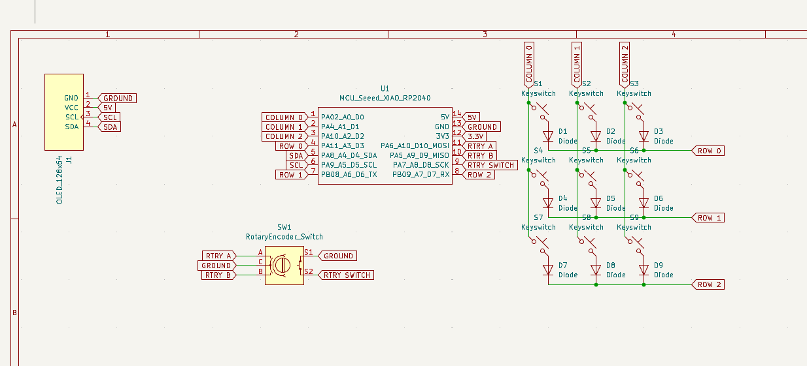

# The DM’s Grimoire

The **DM’s Grimoire** is a D&D **macropad** built for Dungeon Masters to control their campaigns. With 9 mechanical keys, an OLED display, RGB lighting, and a custom spellbook‑style enclosure, this device becomes a physical “grimoire” of power for any tabletop roleplaying game.

---

## Why I Made This

As a long‑time Dungeon enjoyer and the permanent dungeon master (no thanks to my friends), I wanted something that was extremely functional — I wanted it to feel like an artifact from the game world itself. Instead of clicking around with a mouse, now I press a button and summon a thunderstorm… or a dragon roar.|

### Inspiration

---

## Project Photos

### Front View  

### Back View  

---

## 3D Model Screenshot

The 3D‑printed case was modeled in Fusion360 and designed to resemble a magical tome.

---

## Wiring Diagram / Schematic

Here’s the schematic for all switches, OLED, and RGB integration:

---

## PCB Screenshot

Designed using KiCad and printed through Hack Club’s parts inventory.

---

## BOM

| Item                                                | Price    | Link / Source                  |
|-----------------------------------------------------|---------:|--------------------------------|
| OLED Screen 5.5” (1920×1080 AMOLED, USB‑C driver)   | Free     | Owned                          |
| Raspberry Pi Zero 2 W                               | $15 USD  | [PiShop.ca](https://www.pishop.ca/) |
| 9× Mechanical Key Switches                          | HC       | From Approved Parts            |
| 9× Keycaps                                          | Free     | Old keyboards / 3D Printed     |
| 3D Printed Case & Mounts                            | Free     | Custom design + printed        |
| Wires, Header Pins, Screws                          | Free     | Owned                          |
| Custom PCB                                          | HC       | From Approved Parts            |

**_Total Estimated Cost:_** HC covered + ~\$15 for Pi Zero 2 W

Also available as [BOM.csv](./BOM.csv)
